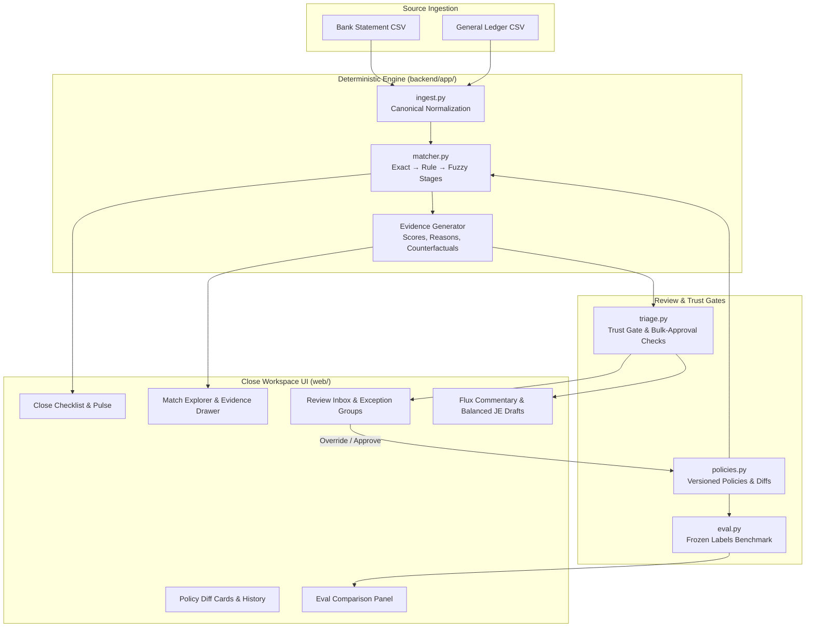

# FinPilot — Audit-Ready Close Copilot

> **Syndicate by Maximor Hackathon · Track 2: Autonomous Office of the CFO**  
> Built with Agent Orchestrator (AO)

---

## 1. What is FinPilot?

**FinPilot** is an open, verifiable month-end close engine and controller cockpit. It takes raw source CSVs (bank settlement statement + GL/ERP export) and runs the complete autonomous close loop:

$$\text{Ingest} \longrightarrow \text{Reconcile} \longrightarrow \text{Escalate} \longrightarrow \text{Review} \longrightarrow \text{Improve}$$

### The Audit-Ready Guarantee
Maximor published that 96% of finance teams desire AI assistance, yet only 14% trust it. FinPilot bridges this trust gap by eliminating ungrounded assumptions:
- **Zero Black Boxes:** Core reconciliation is 100% deterministic (exact → rule-based → string distance via rapidfuzz).
- **Verifiable Evidence Packs:** Every single match decision and exception carries side-by-side raw source rows, normalized field scores, human-readable rationale, and explicit counterfactual boundary statements (*"why NOT auto-matched"*).
- **Strict Human-in-the-Loop Trust Gates:** Triage only groups and flags; it never closes or writes to ledgers. Bulk approvals are gated by confidence $\ge 95\%$, named policy coverage, and amount caps.
- **Governed Policy Evolution:** Controller overrides produce versioned policies (e.g. `MATCH-01 v1 → v2`) with immutable parameter diffs and measured before/after evaluation deltas.
- **Balanced Journal Drafts Only:** Adjustments draft balanced entries ($\text{Debits} = \text{Credits}$) referencing source evidence IDs without posting directly to production ledgers.

---

## 2. Quickstart (3 Lines)

```bash
# 1. Install dependencies
pip install -r requirements.txt && npm install

# 2. Build production UI
npm run build

# 3. Launch the unified close workspace server
uvicorn backend.app.server:app --port 8000
```

Open [http://localhost:8000](http://localhost:8000) to view the live dashboard, or run the frontend dev server via `npm run dev --port 5173`.

---

## 3. Verified Benchmark & Evaluation Metrics

FinPilot's evaluation harness (`backend/app/eval.py`) scores reconciliation decisions against a frozen, seed-generated ground truth benchmark (`eval/labels.jsonl`):

| Metric | Target | Baseline (Policy v1) | Measured Status |
| :--- | :---: | :---: | :---: |
| **Match Precision** | 1.000 | **1.0000** | ✅ Verified |
| **Match Recall** | 1.000 | **1.0000** | ✅ Verified |
| **Match F1 Score** | 1.000 | **1.0000** | ✅ Verified |
| **False Auto-Closes** | **0** | **0** | ✅ Zero false closes |
| **Inbox Review Size** | 18 | **18** | ✅ Triaged cleanly |
| **Exception Classification** | 18/18 | **18/18 (100%)** | ✅ All 5 kinds identified |

### Exception Classification Breakdown
- `TIMING_DIFF`: 4/4 (100.0%)
- `DUPLICATE`: 3/3 (100.0%)
- `MISSING_ENTRY`: 3/3 (100.0%)
- `AMOUNT_MISMATCH`: 4/4 (100.0%)
- `COUNTERPARTY_MISMATCH`: 4/4 (100.0%)

Run the evaluation CLI locally at any time:
```bash
python -m backend.app.eval --labels eval/labels.jsonl --out out/eval.json
```

---

## 4. Architecture



---

## 5. How this was built with Agent Orchestrator (AO)

FinPilot was built end-to-end following the Maximor AO specification using dedicated agent sessions, isolated git worktrees, and PR verification loops:

1. **Session 1 — `engine-a1` (`ao/finpilot-3/engine-a1` · PR #1)**
   - Implemented canonical ingestion (`backend/app/ingest.py`) and multi-stage deterministic matching (`backend/app/matcher.py`).
   - Defined the core schema contract (`schema/close.schema.json`) and synthetic seed generation (`data/seed/generate_data.py`).
   - Froze benchmark ground truth (`eval/labels.jsonl`) with 79 transactions (61 clean pairs + 18 labeled exceptions across 5 distinct categories).
   - Delivered 24 passing unit tests covering all matcher stages.

2. **Session 2 — `ui` (`ao/finpilot-4/ui` · PR #2)**
   - Built the responsive dashboard with Vite + React + TypeScript and custom CSS styling.
   - Built the Match Explorer with slide-over Evidence Drawer inspecting raw source rows, deterministic field scores, and counterfactual boundaries.
   - Implemented the Review Inbox with primary-cause grouping, bulk approval trust gate, and policy override bump flows.
   - Created Policy diff inspection cards, live Evaluation before/after metrics comparison, and evidence-linked Flux Commentary.

3. **Session 3 — `orchestrator / reviewer` (`ao/finpilot-orchestrator` / `main`)**
   - Merged PR #1 and PR #2 into a unified production repository.
   - Built the deterministic evaluation harness (`backend/app/eval.py`) aligned with GitHub Actions CI (`.github/workflows/eval.yml`).
   - Implemented the FastAPI workspace server (`backend/app/server.py`) satisfying all 12 endpoints of the frontend HTTP contract.
   - Implemented trust gates (`backend/app/triage.py`), balanced journal entry drafting, and deterministic flux narration (`backend/app/narrate.py`).
   - Added full integration and API test suite (31/31 unit and integration tests passing).

---

## 6. Repository Layout

```
FinPilot/
├── AGENTS.md                  # Hackathon build blueprint & single source of truth
├── schema/
│   └── close.schema.json      # JSON Schema contract for transactions, evidence & runs
├── backend/
│   ├── app/
│   │   ├── server.py          # FastAPI application implementing the workspace API
│   │   ├── main.py            # API entry point
│   │   ├── ingest.py          # Canonical CSV ingestion (preserves raw source rows)
│   │   ├── matcher.py         # Exact → Rules → RapidFuzz deterministic matching
│   │   ├── triage.py          # Exception classification & bulk-approval trust gates
│   │   ├── policies.py        # Versioned policy definitions and diff tracking
│   │   ├── narrate.py         # Balanced journal drafts & flux commentary
│   │   └── eval.py            # Frozen benchmark evaluation harness
│   └── tests/                 # Complete test suite (31 tests, pytest)
├── src/                       # React + TypeScript dashboard UI
├── data/
│   ├── sample/                # Canonical sample bank and GL CSVs
│   └── seed/generate_data.py  # Deterministic seed generator
├── eval/
│   └── labels.jsonl           # Frozen ground-truth benchmark
├── .ao/
│   └── launch.json            # AO server configuration
└── .github/workflows/
    └── eval.yml               # Automated CI eval on every PR and commit
```

---

## 7. License

MIT License. Designed for the Maximor Syndicate Hackathon.
